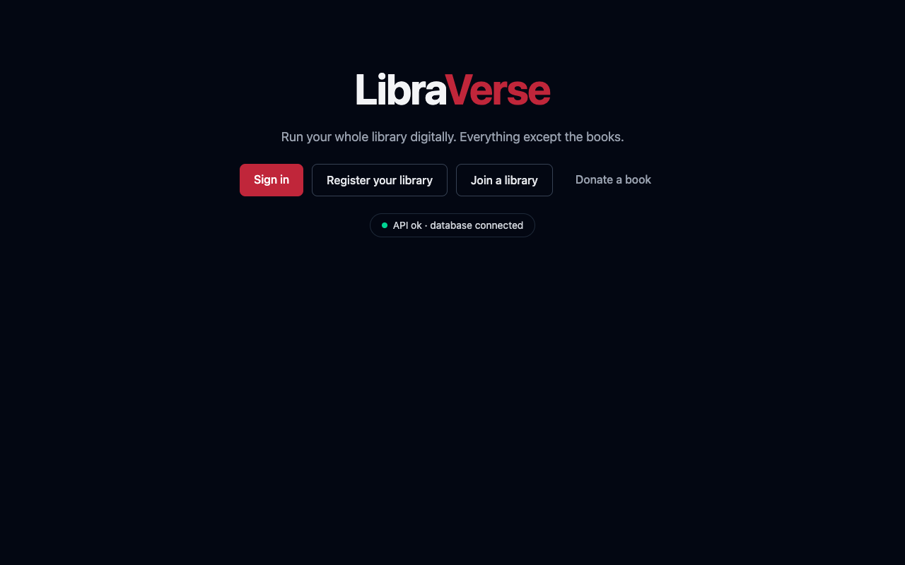
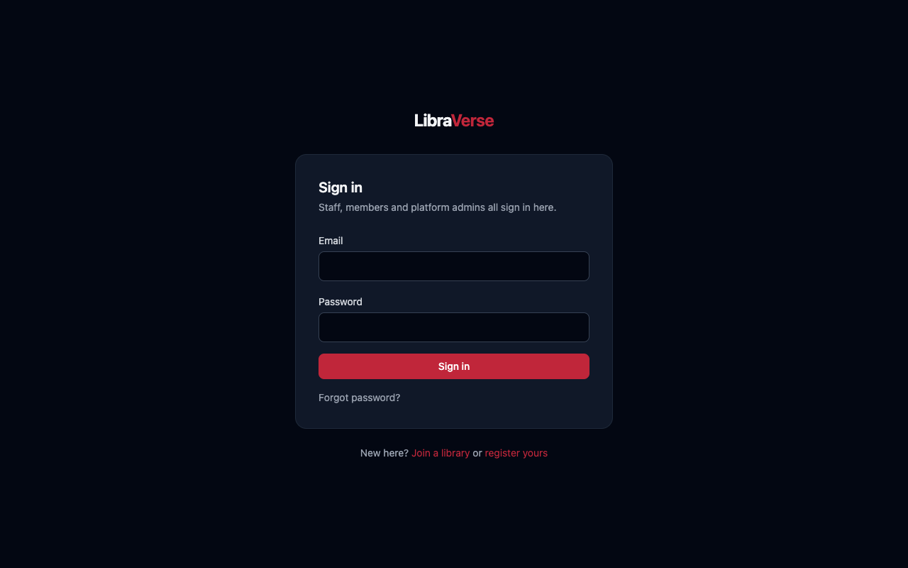
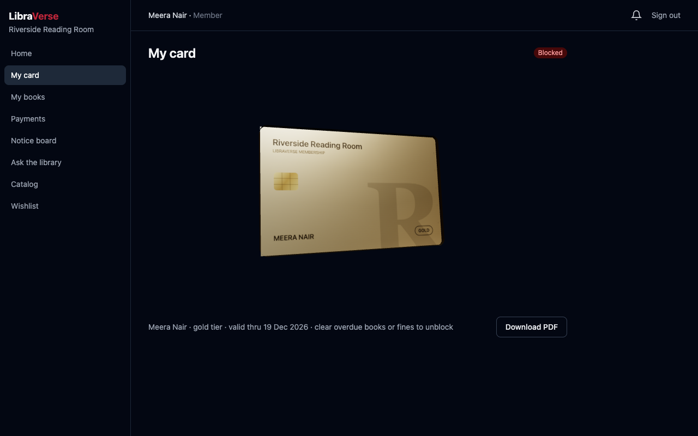
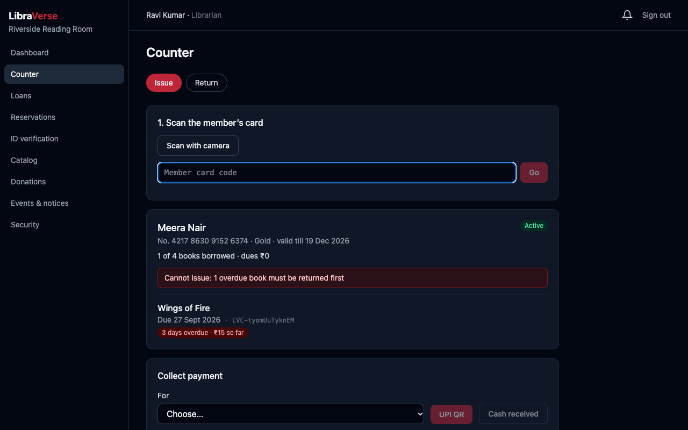
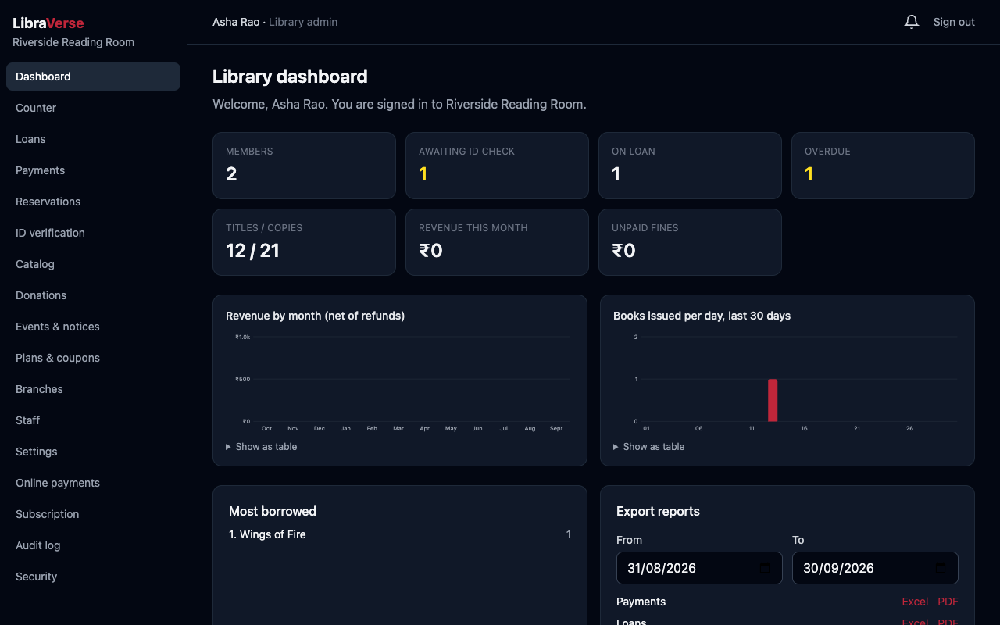
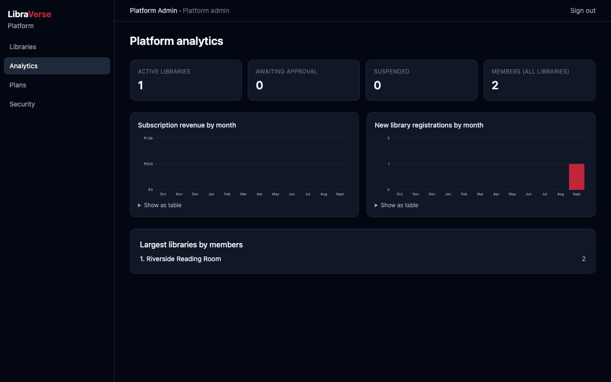
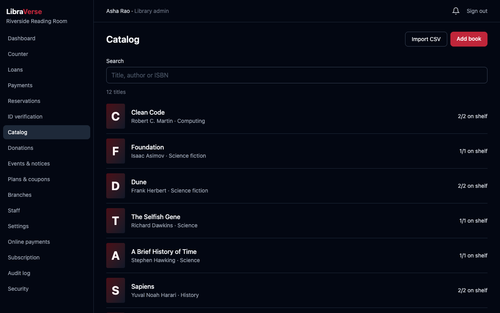
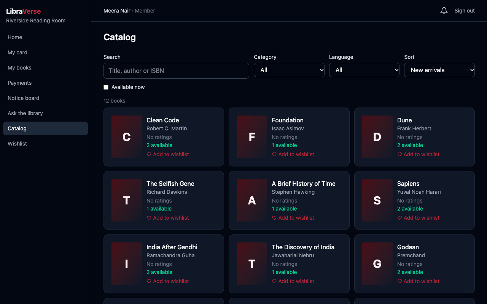
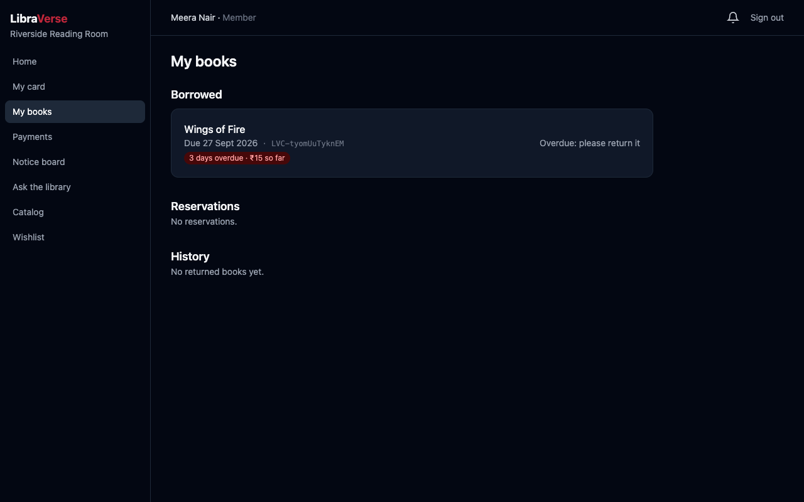
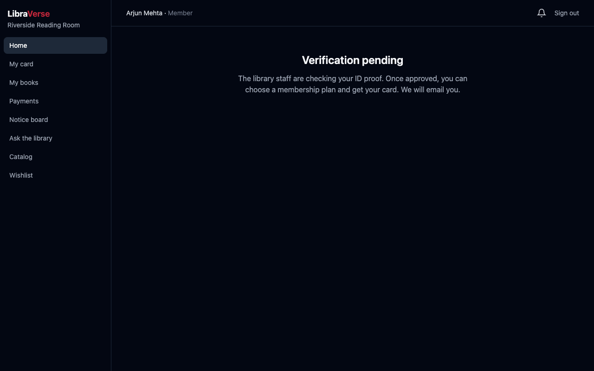

# LibraVerse

Multi-tenant SaaS library management platform: every library gets an isolated, branded workspace with its own Razorpay account, real-time payments over Socket.io, and a 3D virtual membership card. Everything is digital except the books.

Spec: [`docs/LibraVerse_Project_Report.pdf`](docs/LibraVerse_Project_Report.pdf) · Build plan and design decisions: [`docs/PHASES.md`](docs/PHASES.md) · Test cases: [`docs/TESTING.md`](docs/TESTING.md)

## What it does

| Role              | Highlights                                                                                                                                                                                                                            |
| ----------------- | ------------------------------------------------------------------------------------------------------------------------------------------------------------------------------------------------------------------------------------- |
| **Super Admin**   | Approve / reject / suspend libraries, edit Free and Pro plans, platform analytics (library-level totals only), Pro refunds on rejection                                                                                               |
| **Library Admin** | Branding and card colours, branches, librarians, membership plans and coupons, own Razorpay keys (encrypted), subscription, dashboard with Excel/PDF reports, audit log, refunds                                                      |
| **Librarian**     | Counter: scan the member's card then the book to issue; returns with automatic late fines; UPI-QR and cash payments; ID verification; catalog with ISBN auto-fill, CSV import and QR sticker sheets; reservations; donations; notices |
| **Member**        | Join with ID proof, 3D card with a one-time reveal, search and reserve books, reviews and wishlist, renew loans, pay fines and plans online with a live countdown, receipts, notifications (in-app, email, push), AI assistant        |

## Stack

npm-workspaces monorepo, TypeScript everywhere.

| Workspace | What                                                                                                                                                                                         |
| --------- | -------------------------------------------------------------------------------------------------------------------------------------------------------------------------------------------- |
| `shared/` | Enums, API types and role rules used by both sides                                                                                                                                           |
| `server/` | Express 5, Mongoose (MongoDB Atlas), Zod, Socket.io, Razorpay, node-cron, PDFKit, exceljs, Nodemailer, Cloudinary, web-push, Anthropic SDK · tests: Jest + Supertest + mongodb-memory-server |
| `client/` | React 19 + Vite, Tailwind, React Router, TanStack Query, React Three Fiber + Drei, Framer Motion, html5-qrcode, vite-plugin-pwa · tests: Vitest + Testing Library                            |

Key rules the code enforces (details in `CLAUDE.md` and `docs/PHASES.md`):

- **Tenant isolation:** a Mongoose plugin scopes every query, update, delete, aggregate and save to the signed-in user's library and throws without a context (TC-07 suite).
- **Payments:** confirmed only by a Razorpay webhook verified with HMAC-SHA256 over the raw body; one state machine (`created → pending → success | failed | expired`); expiry cron; late captures auto-refunded; money in integer paise.
- **Secrets:** each library's Razorpay key secret and webhook secret are AES-256-GCM encrypted and never returned.
- **Card QR:** HMAC-signed and verified on every scan. **Audit log:** append-only and hash-chained.

## Getting started

Requires Node 20+ and a MongoDB connection string (Atlas free tier, or a local `mongod`).

```bash
npm install
cp server/.env.example server/.env    # set MONGODB_URI; generate the secrets as described in the file
npm run seed:demo -w server           # optional: a demo library with sign-ins for every role
npm run dev                           # API on :4000, web app on :5173
```

Open http://localhost:5173. With the demo data, sign in with password `Demo-pass1` as `admin@libraverse.demo` (Super Admin), `owner@riverside.demo` (library admin), `librarian@riverside.demo`, `member@riverside.demo` or `newmember@riverside.demo` (ID awaiting verification).

To start from scratch instead, create the platform owner with `npm run create-super-admin -w server -- you@example.com "Your Name"` and open the printed set-password link.

Without SMTP settings, emails (set-password links, OTP codes, receipts) are printed in the API terminal.

### Optional features (switched on by environment variables in `server/.env`)

| Feature                                     | Variables                                                                                      |
| ------------------------------------------- | ---------------------------------------------------------------------------------------------- |
| Real email                                  | `SMTP_HOST`, `SMTP_PORT`, `SMTP_USER`, `SMTP_PASS`, `MAIL_FROM`                                |
| Cloud file storage (else `server/uploads/`) | `CLOUDINARY_URL`                                                                               |
| Member payments                             | Each library admin enters their own Razorpay **test** keys under Online payments               |
| Pro plan billing                            | `PLATFORM_RAZORPAY_KEY_ID`, `PLATFORM_RAZORPAY_KEY_SECRET`, `PLATFORM_RAZORPAY_WEBHOOK_SECRET` |
| Web push                                    | `VAPID_PUBLIC_KEY`, `VAPID_PRIVATE_KEY` (`npx web-push generate-vapid-keys`)                   |
| AI assistant                                | `ANTHROPIC_API_KEY`                                                                            |
| Google sign-in                              | `GOOGLE_CLIENT_ID`                                                                             |

Razorpay webhooks must reach the API: in development use a tunnel (for example `ngrok http 4000`) and set `PUBLIC_API_URL` to its https URL; the webhook URL to paste into Razorpay is shown on the Online payments page.

## Scripts (run from the root)

| Command                                                    | Does                                                                                                             |
| ---------------------------------------------------------- | ---------------------------------------------------------------------------------------------------------------- |
| `npm run dev`                                              | API (tsx watch) and client (Vite) together                                                                       |
| `npm test`                                                 | Server Jest suite, then client Vitest suite, on an in-memory MongoDB (the first run downloads a ~85 MB `mongod`) |
| `npm run typecheck`                                        | `tsc --noEmit` in every workspace                                                                                |
| `npm run lint` / `npm run format`                          | ESLint / Prettier                                                                                                |
| `npm run build`                                            | Bundles the API to `server/dist` (tsup) and the client, with its service worker, to `client/dist`                |
| `npm run seed:demo -w server`                              | Demo library and accounts (refuses to run in production)                                                         |
| `npm run create-super-admin -w server -- <email> "<name>"` | Platform owner account with a set-password link                                                                  |
| `npm run setup-keys -w server`                             | Paste each outside service's keys (hidden input) into `server/.env`, then check them                             |
| `npm run check-services -w server`                         | Tests MongoDB, email, Cloudinary, Anthropic, Razorpay and Google settings without printing any secret            |
| `npm run render-env -w server -- [site-url] [api-url]`     | Writes the production settings to `~/Desktop/libraverse-render.env` for Render's "Add from .env"                 |

## Deploying (Render + Vercel + MongoDB Atlas)

1. **Keys:** `npm run setup-keys -w server` (in your own terminal), then `npm run render-env -w server`. It keeps `ENCRYPTION_KEY` and `CARD_QR_SECRET` the same as local, because the shared Atlas database holds values encrypted with them and issued card QRs are signed with them.
2. **API on Render:** New → Blueprint → pick this repository (`render.yaml` defines `libraverse-api`). In the service's Environment, use "Add from .env" with `~/Desktop/libraverse-render.env`, then delete that file. In Atlas → Network Access, allow Render's outbound IPs (or `0.0.0.0/0` for a demo).
3. **Web app on Vercel:** import the repository with **Root Directory `client`**. `client/vercel.json` proxies `/api` to `https://libraverse-api.onrender.com` (change it if Render gave the service another name). Set `VITE_SOCKET_URL` to the Render URL for live updates.
4. **Razorpay:** each library pastes the webhook URL shown on its Online payments page into Razorpay (events `payment.captured`, `payment.failed`); the platform webhook is `<PUBLIC_API_URL>/api/webhooks/razorpay/platform`.
5. **Google sign-in:** add the Vercel URL (and `http://localhost:5173`) to the OAuth client's Authorised JavaScript origins.
6. **Super Admin:** `npm run create-super-admin -w server -- you@example.com "Your Name"` (locally or in the Render shell; both use the same database).

## Screenshots

Captured from the demo data (`npm run seed:demo -w server`).

|                                                                                   |                                                                                                          |
| --------------------------------------------------------------------------------- | -------------------------------------------------------------------------------------------------------- |
|  Landing                               |  One sign-in page for every role                                |
|  3D membership card (Gold tier)        |  Counter: card scanned, issue blocked with the reason |
|  Library dashboard |  Super Admin analytics                  |
|  Staff catalog                         |  Member search and filters                      |
|  Member's loans and fines            |  Waiting for ID approval            |
